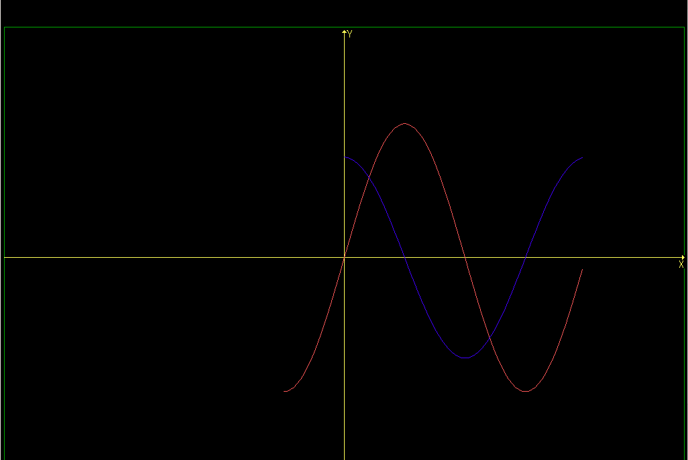

# Proyecto de ejemplo libreria svga

Este repositorio contiene un proyecto de ejemplo para poder trabajar con la librería vga
Este proyecto solamente funcionará en ubuntu 14.04
## Configuración y compilación
Para configurar y compilar el proyecto se necesita tener instalado **cmake**. 

```bash
sudo apt install cmake
```

una vez instalado CMake se puede proceder a compilar el proyecto:

1. Cree una carpeta para guardar los archivos intermedios y binarios:

    ```bash
    mkdir build
    cd build
    ```

2. Genere los archivos de compilacion con cmake

    ```bask
    cmake ..
    ```

3. Compile el proyecto

    ```bash
    make
    ```


Una vez compilado el proyecto puede ejecutarlo usando el siguiente comando:

```bash
sudo ./supervga
```

Deberá ver lo siguiente en la pantalla:



para salir del programa presione cualquier tecla.
